# Model

## 25 sep.

feedback: probeer dat je je klant alleen laat weten dat wij niks me je data doen, maar alleen maar informeren dat het er is. Maar dat wij het niet opslaan en er niks mee doen.

## 24 sep

Vandaag had ik een stress coach gesprek waardoor ik op school was.
Hiernaast ging ik mijn 2 htmls willen koppelen. Dit wou ik doen met een knop. En hier kwam ik helemaal niet uit.

Daardoor moest ik helaas chatgpt vragen om
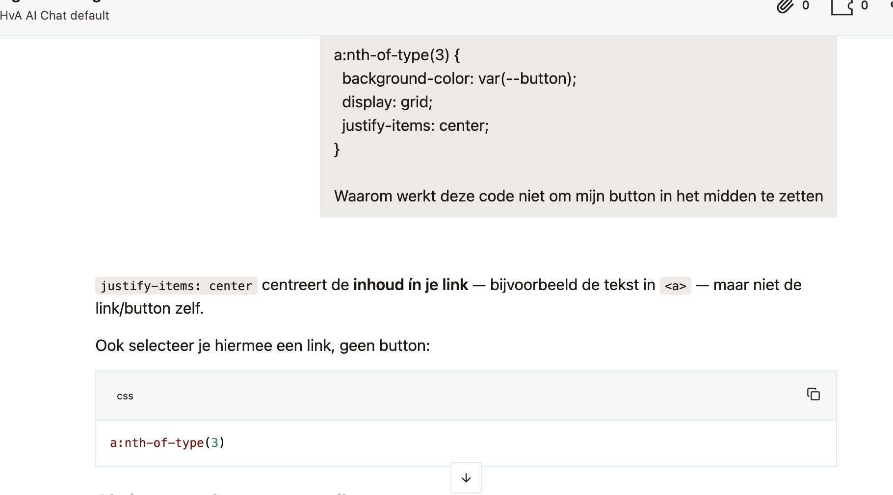
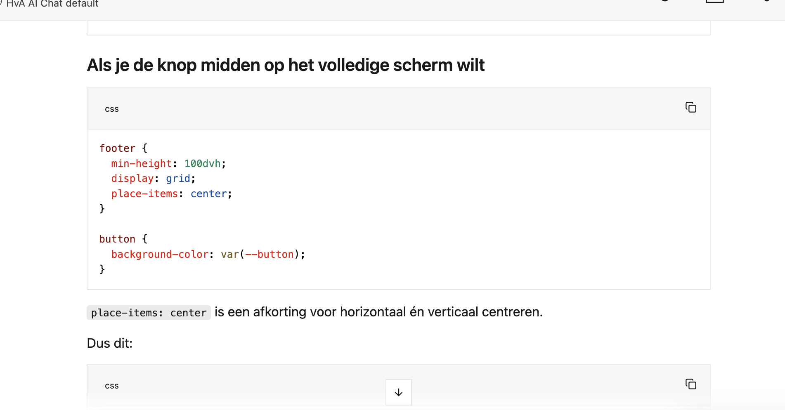
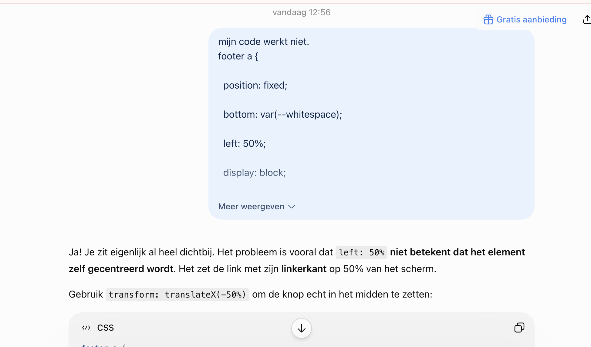
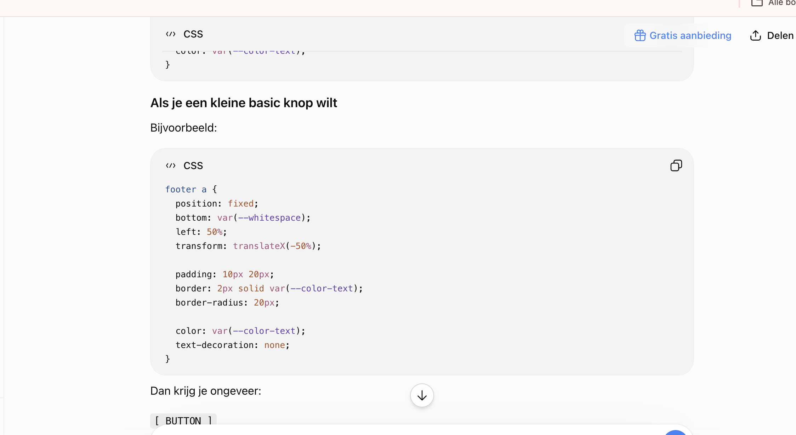

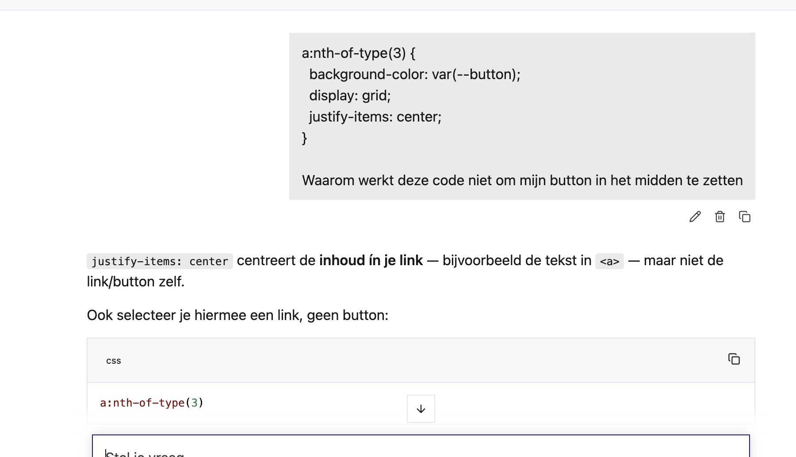
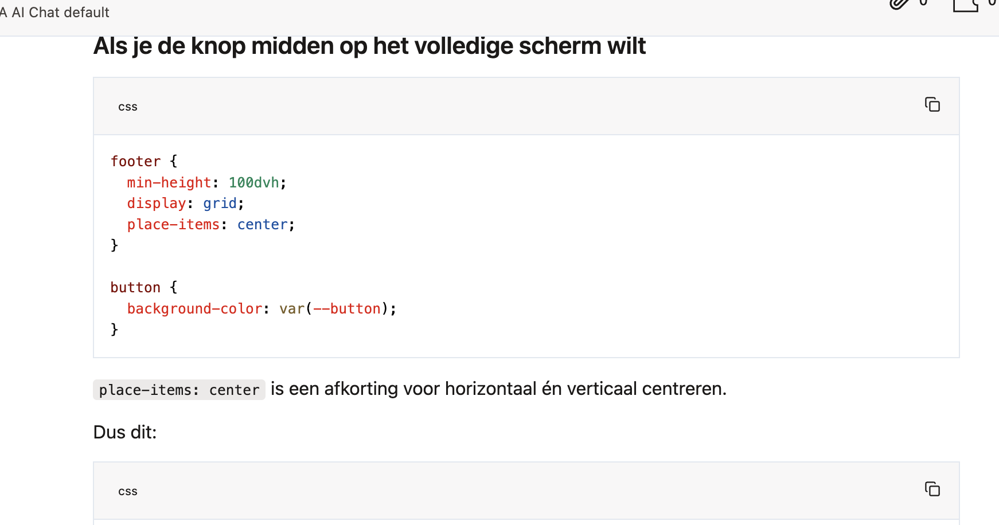
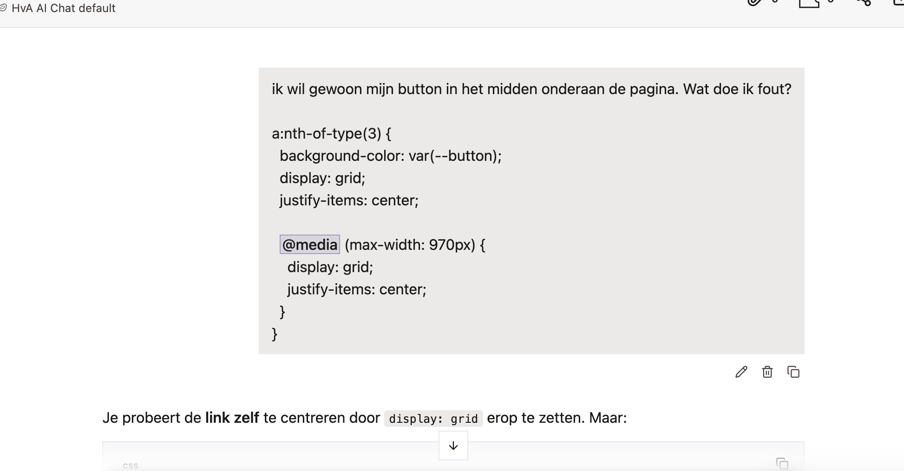
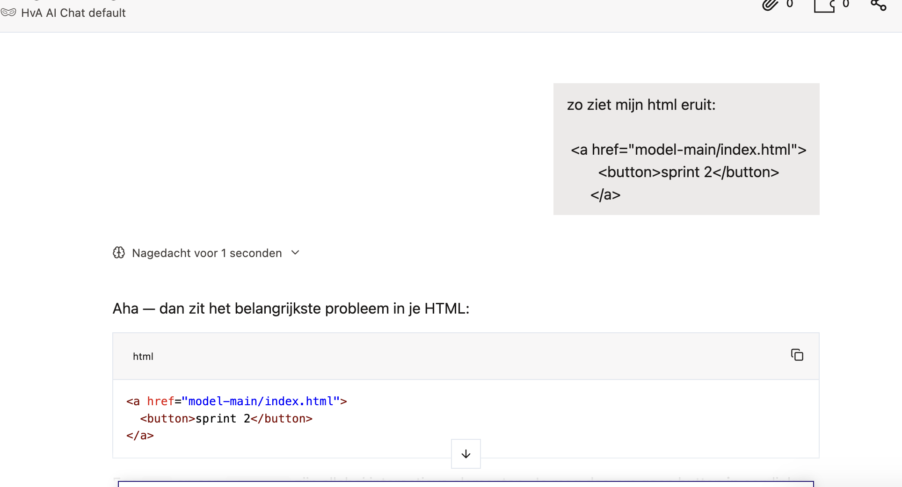
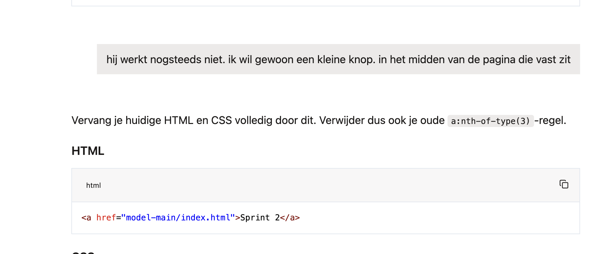

Uiteindelijk heb ik hier weinig tot niks van gebruikt. Omdat ik nergens duidelijk uit kwam.
En heb ik mijn eige oude code gebruikt.

Hiernaast ik een schets gemaakt van verschillende schetsen gemaakt waarin ik ideen kon uiten van hoe ik mijn onderdelen wil zien.

## 23 sep

Vandaag had ik de lecture in het KSH gebouw. Dit was extreem informatief. Nu weet ik meer over hoe data zich verspreid. En welke soort data's er zijn. En welke wetten waar aan vast zit. Dit waren dingen die ik hiervoor wel wist maar nu meer overna gedacht hebt.
Ook was het leuk om op een anderen manier te kijken naar hoe bedrijven om deze wetten heen proberen te komen. Hier waren de notes die ik hiervan had genomen
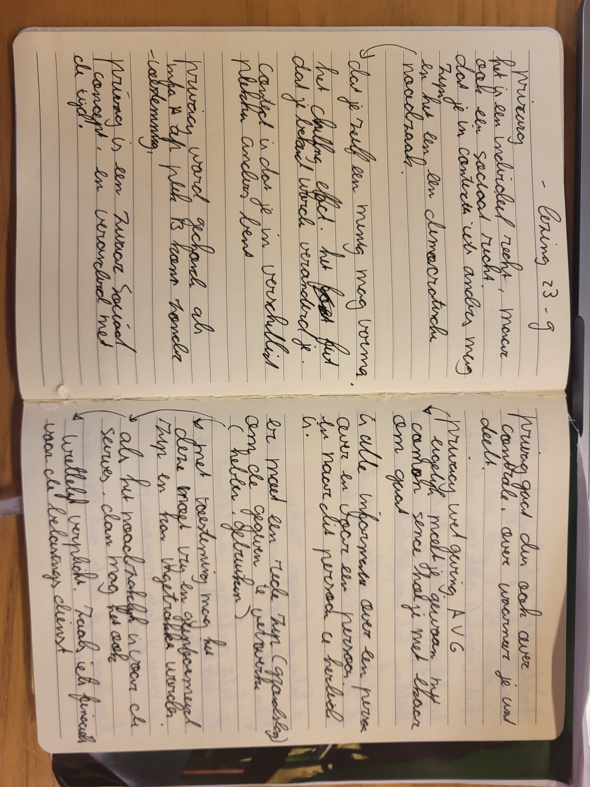
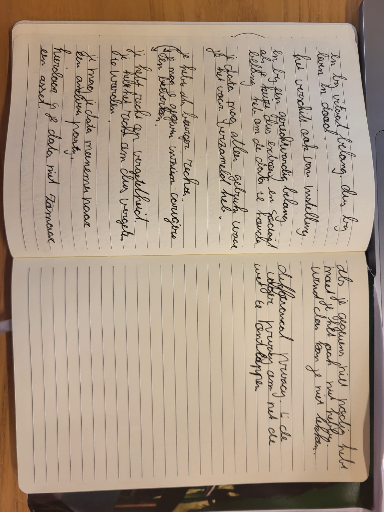

Hiernaast had ik verschillende. websites bekeken en verschillende bronnen gebruikt om te kijken wat voor soort data toesteming er was. Dit waren de notes hiervan:

De verschillende toestemmingen die ik moet vragen zijn:
GitHub pages hosting
digitaaltuintje component
Visual studio code.
Instagram omdat ik foto’s link.
Microsoft.
TransIP

Hoe kan je gebruikers informeren over het gebruik van hun gegevens op jouw website?:
Door het in jip en janneke taal neer te zetten in verschillende tabbladen. Zodat ze makeelijk kunnen klikken en kijken zonder overweldigd te worden door verschillende elementen.
Ook zodat ze goed uit kunnen sorten. Ik wil Paradiso en Melkweg, als voorbeeld nemen. Hun hadden alle elementen verschillende gezet zodat je goed dingen kon afwijzen en anderen dingen kon accepteren.

Op welke manier kan je instemming vragen? Doe desk-research en zoek tenminste 10 verschillende manieren van het vragen van consent op het web.
https://www.combell.com/nl/blog/soorten-cookies/
https://veiliginternetten.nl/wat-zijn-cookies/
https://pec.surf.nl/faqs/hoe-vraag-je-om-toestemming-wat-is-er-nodig/
https://www.combell.com/nl/blog/soorten-cookies/
https://veiliginternetten.nl/wat-zijn-cookies/
https://www.dailycms.com/artikelen/cookiemelding-op-je-website-wanneer-is-deze-wel-of-niet-verplicht/
https://www.dailycms.com/artikelen/avggdpr-wat-betekent-deze-wetgeving-voor-websites-en-webwinkels/
https://www.weer.nl/
https://www.telegraaf.nl/
https://www.tivolivredenburg.nl
https://www.zapp.nl/
https://www.zuiderzeemuseum.nl

Door duidelijke fotos te laten zien van waar je data heen gaat.

Door het duidelijk uit te leggen. In een grote tekst gelijk

Door het in kleine mapjes te zetten om makkelijk doorheen te gaan.

Door per pagina alleen daar de bijbehorende data knoppen te zetten zodat mensen weten waar wat heen gaat

Door ze gewoon te informeren welke data ze nemen. Terwijl je ze laat weten dat het nee zeggen je naar een anderen pagina leid.

Een vol scherm pop up neerzetten waar in het klein de info op staat, en ze uitnodigen om verder te lezen.

Een volscreen pop up maken. Waarin er verschillende keuze knoppen zijn.

Een kleine onderdeel neer te zetten onder aan de pagina. Waarin een uitleg zin staat. En dat dus niet uitdaagt om verder te lezen.

Met kleine icoontjes die de onderdelen representeren.

Ze 2 opties geven: waar ze alleen de noodzakelijke cookies kunnen accepteren en alles

Denk na over een manier van werken die past binnen de layout van jouw digital
garden?:
Iets makkelijks. Ik wil iets maken dat zelfs oma's van 80 zouden snappen. Waarin het duidelijk is. En de knopen allebij even groot zijn.

Hiernaast had ik gekeken naar een app/website die wel verschillende dark patterns gebruiken. voor mij is duolingo de meet ulitmate dark pattern bedrijf. Want het hele concept is een dark pattern vanwegen de streak opties.
Hiernaast vindt ik de super pagins het meest vervelend. Want ze duwen het zwaar door dat je dit nodig hebt. Dus deze dark pattern had ik uitgetekend:
Dit was hoe hij er normaal eruit ziet.
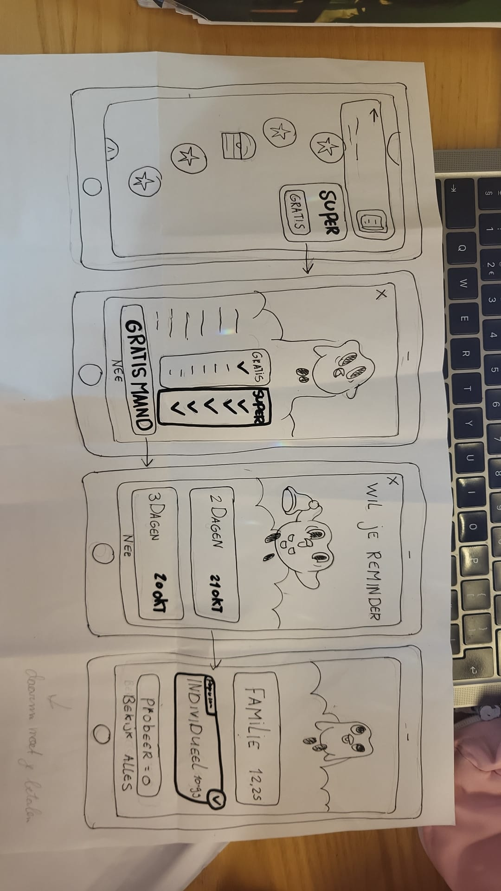

Dit is hoe hij er uit kan zien als hij wel goed ziet.
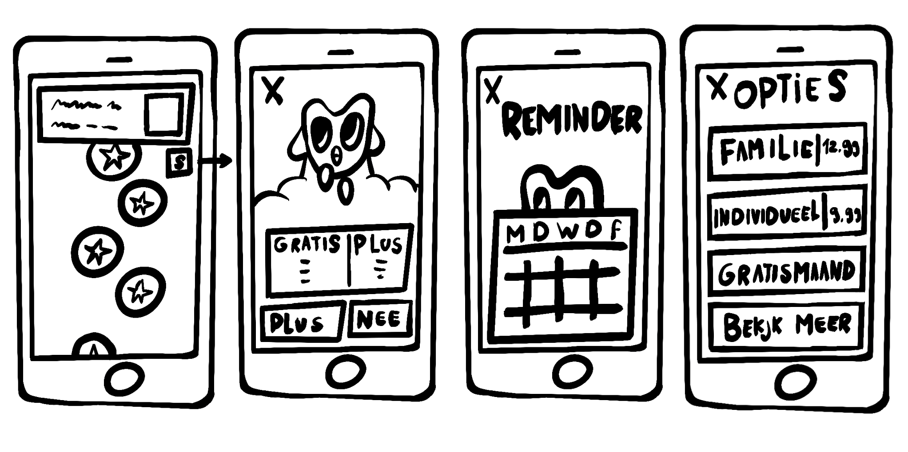
Mijn ontwerp heeft alles beter. Alles staat gelijk wat een opties niet slechter of beter maakt dan de anderen.
Ook geeft hij duidelijke ALLE opties aan en moedigt hij niet er gelijk een aan. Natuurlijk heb je met deze opties ook dat je ja kan zeggen zonder je gevens te moeten geven.

Hiernaast had ik de workshop over Javascript gevolgt.
Hier zijn de vidoes hiervan
<video width="320" height="240" controls>

  <source src="images/module2/opdracht_1_java.mov" type="video/mp4">
  <video width="320" height="240" controls>
  <source src="images/module2/opdracht_2_java.mov" type="video/mp4">
<video width="320" height="240" controls>
  <source src="images/module2/opdracht_3_java.mov" type="video/mp4">
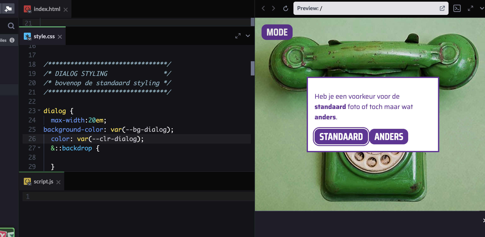

## 22 sep

Ik had deze dag mijn README bijgewerkt omdat ik een beetje achter liep.
Hiernaast moest ik nog even aan mijn nieuwe code zitten.
Ik wou de kleuren goed zetten en de grid goed zetten.
De kleuren waren nu wel gelukt. Omdat mijn grid niet goed gelinkt was kon niks koppelen.
Helaas moest ik dit wel even chatgpt hiervan vragen:
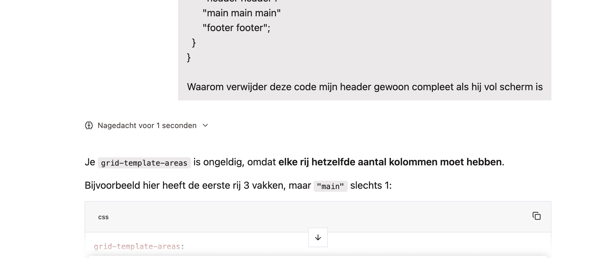
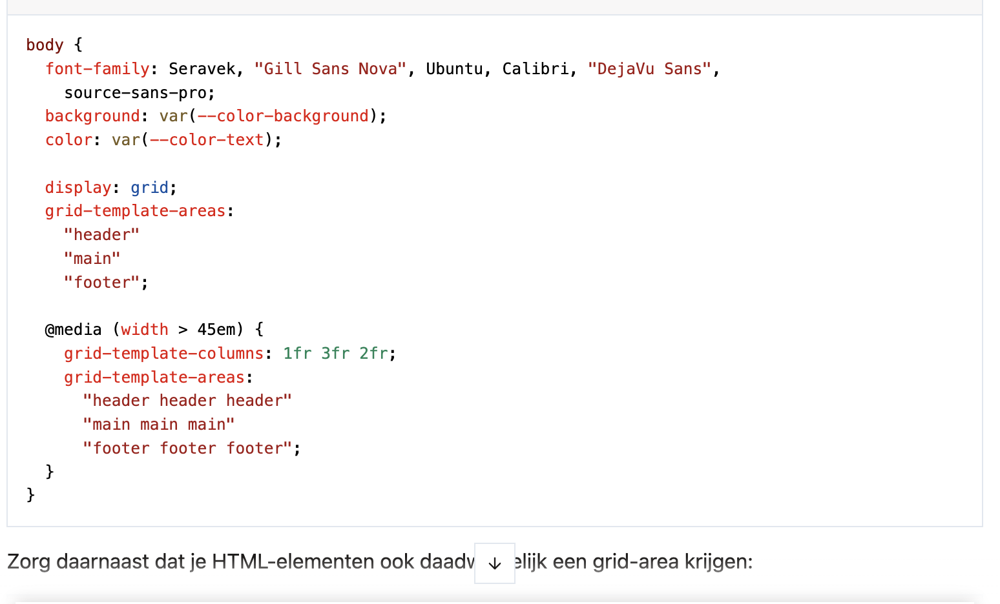
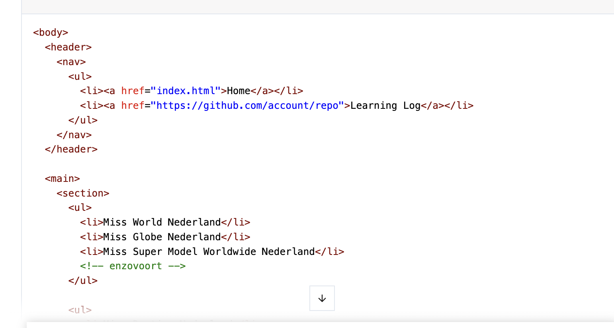
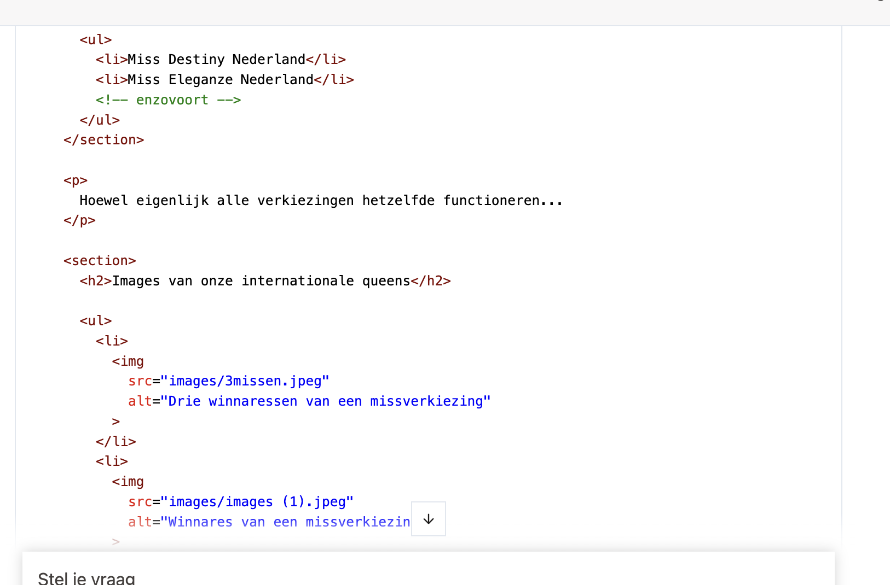
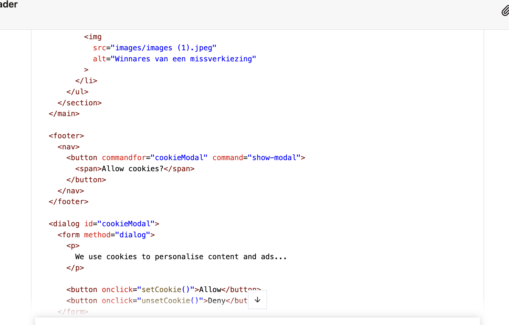
Hiernaast lukten dus mijn grid niet. En deze daarom dus wel.
Hiernaast stond mijn footer ineens in het midde van mijn pagina. Dit moest ik weer aan chat vragen. Hierdoor ben ik er wel uit gekomen.

Hiernaast had ik een rare gap in mijn pagina. Nadat ik hier niet uit kwam had ik het gevraagt. Maar hier kwam chat ook helaas niet uit
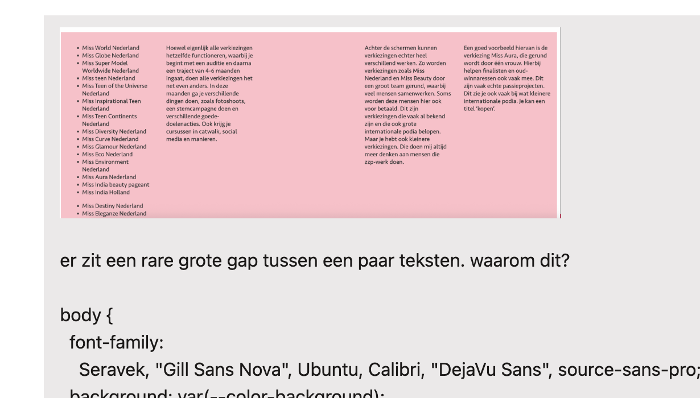
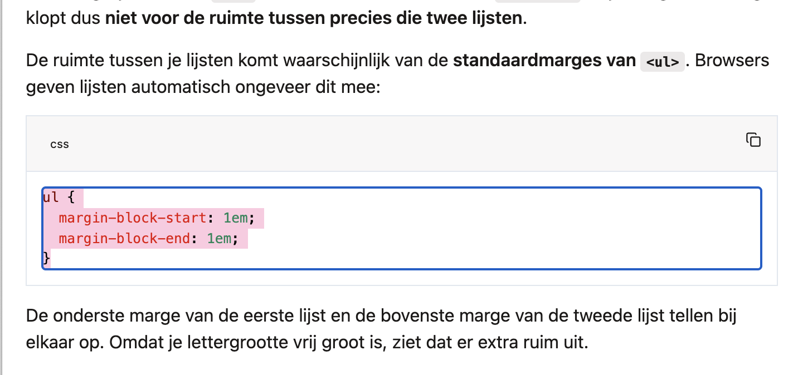

Hier zijn de screenshots van de website tot nu toe:
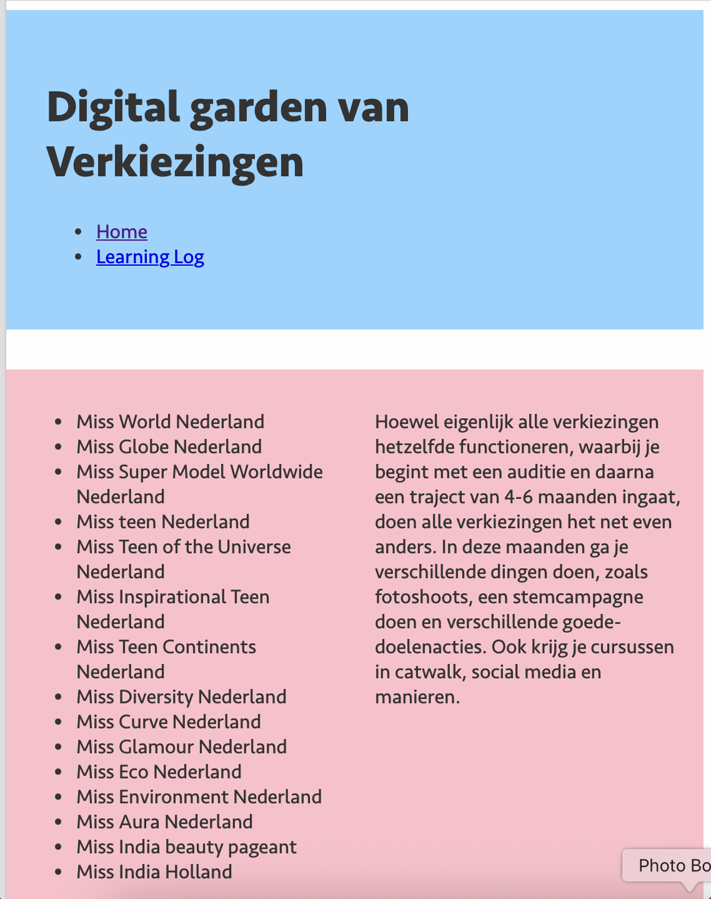
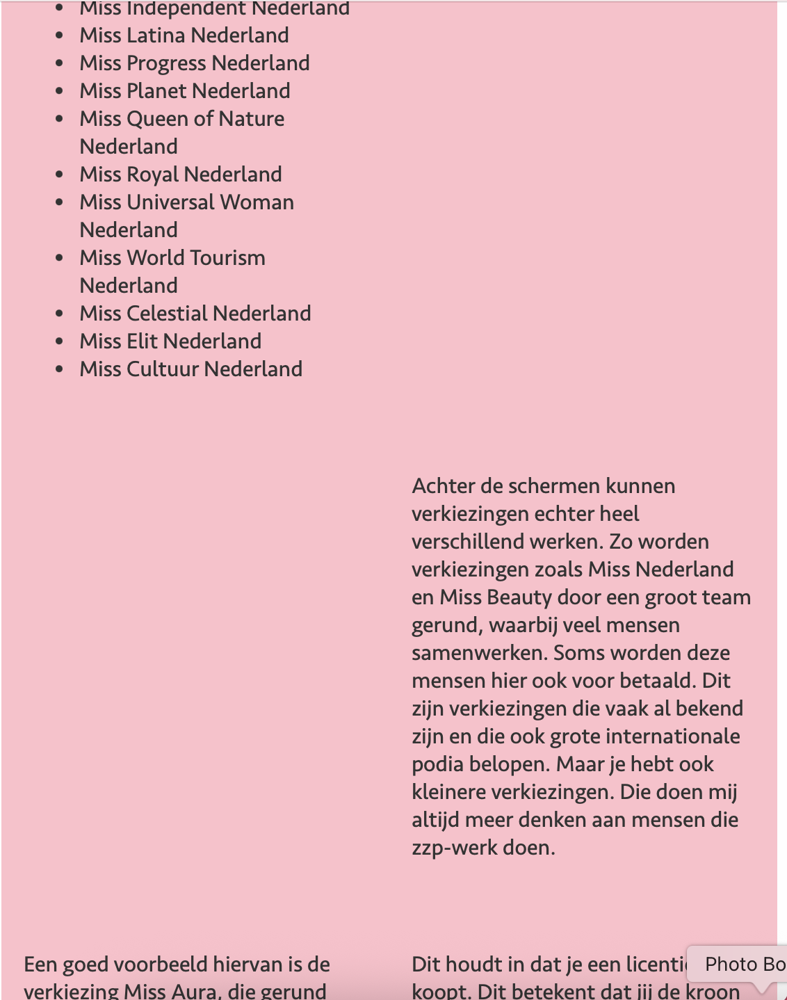
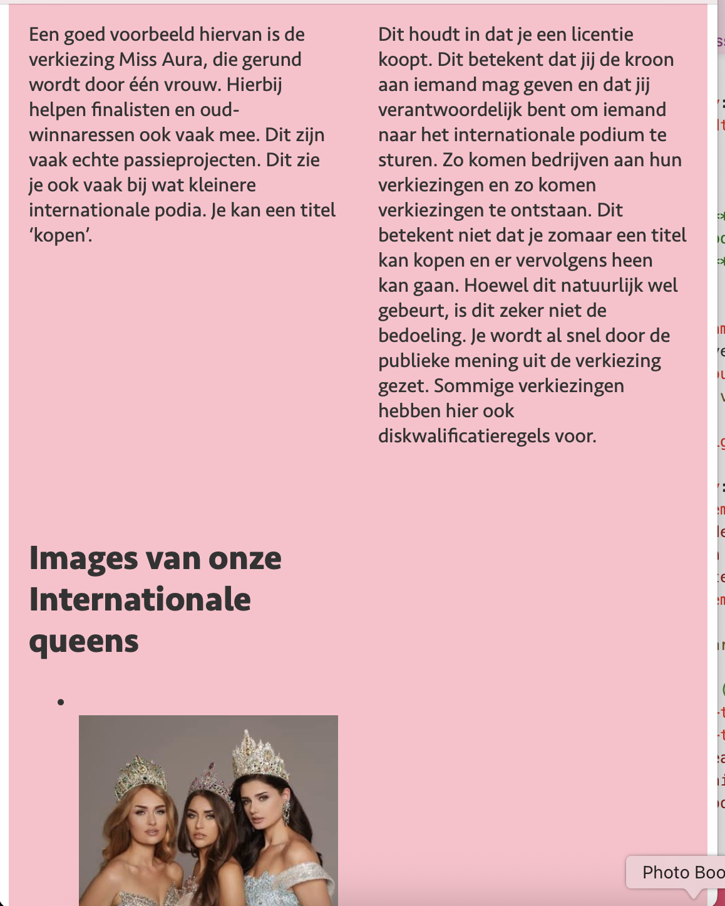
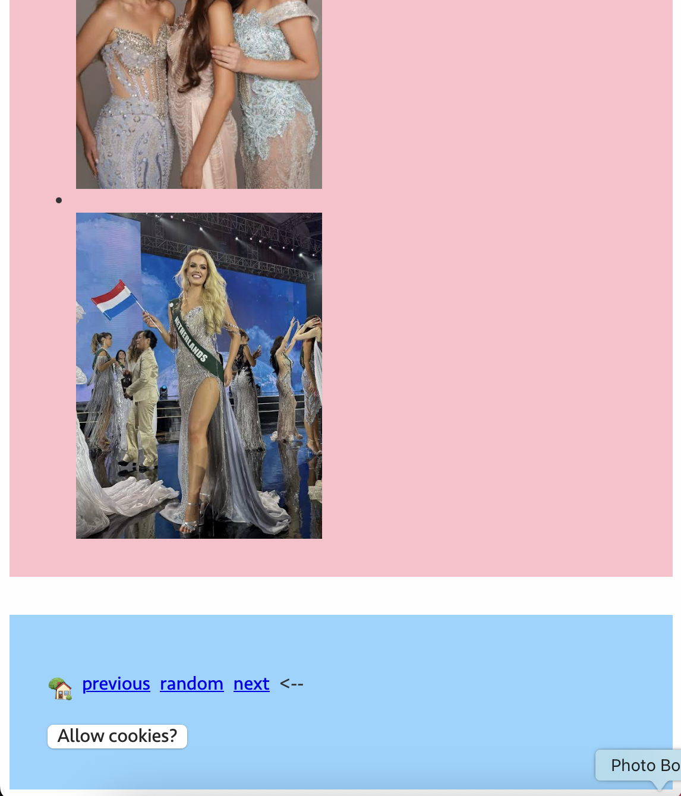

En de fullscreen:
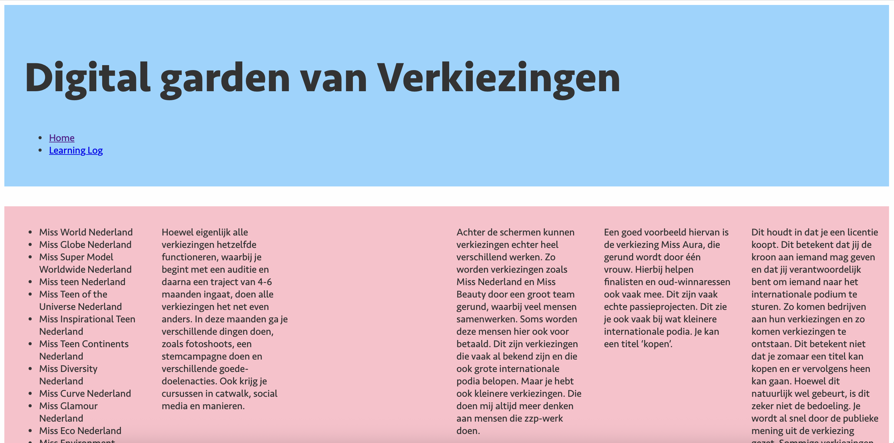
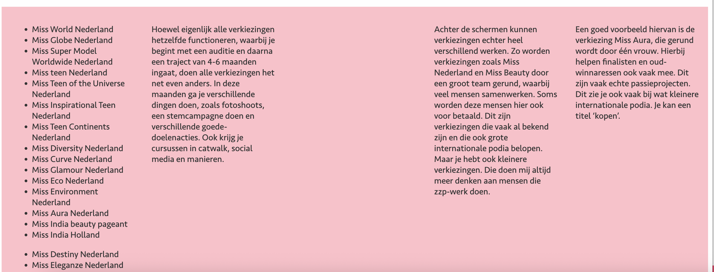
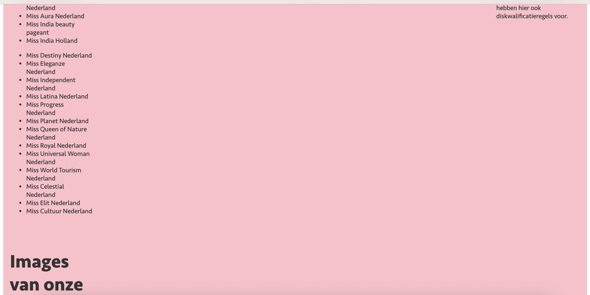

hiernaast heb ik de artiekel gelezen:

Notes
What are dark patterns in UX:

Dark pattern design is design om een specefieke actie uit te dagen. Vaak worden ze dan gemanipuleerd.
Vaak willen ze dat je meer betaald voor iets. Dat je je aanmeld. Dat je data deelt. En dat je gewoon een beslissing maakt die je normaal niet genomen had.

Het komt van UX designer Harry Brignull uit 2010.

Deze patronen zijn zwaar on ethisch.
Dark patterns maken misbruik ban de manier hoe mensen al met apps omgaan. Door dingen op specifieken plekken neer te zetten.

Door dit soort apps te veel te gebruiken kan je mistrust creeren in niet alleen jou website maar ook anderen websites.

12 soorten van dark patterns zijn:
Hidden costs, door iets te verbergen onder anderen kosten.

Bait and switch
Door gebruikers neer te zetten op plekken waar ze denken dat het een leid naar het een, terwijl het ineens naar iets anders leid.

Forced Continuity. Als een website je tricked in bepaalde gegevens in te voeren. Waardoor hij ze gelijk kunnen gebruiken na de free trail.

Roach motel. Warneer een bedrijf het makkelijk maken om je aan te melden. Maar het extreem moeilijk maken om je weer tegen iets af te melden.

Misdirection, om je gelijk iets anders te laten zien. En dus de goedkopere optie niet duidelijk te maken.

Confirm shaming. Door je te schamen met bepaalde woorden om je het idee te geven dat je iets fout doet als je dingen niet doet.

Sneak into basket. Als hij dingen er gewoon bij zet zonder het echt te benoemen.

Friend spam, Ze liegen dan tegen je om je social media in te voeren voor ‘vrienden’ maar ze willen gewoon echt je data.

Disguised ads:
Als je verchillende buttons een anderen vorm geeft. Terwijl het eigelijk een add is.

Trick questions. Zodat ze de woorden verkeerd verwoordt zodat je de verkeerde keuze maakt.

Fomo. Door je te beschamen als je dingen niet doet. En dingen niet koopt.

Price Comparison. Door prizes naar elkaar te vergelijken om verschillende prijze ziek goedkoop te laten klinken.

De beste manier om dit te vermijden is om duidelijk te zijn, en de uX te leiden naar waar het heen moet leiden.

Notes: mirco interactions:
Micro interactions helpen bij het weten wat je oprecht doet bij een app of websiye. Het is het verschil tussen een product waar je van houdt en die je gewoon tolereert.

Design is niet alleen om dingen op te lossen.
Dingen zoals een goede klik kan veel vreugde brengen naar mensen als je ontwerpt.

Micro interacties staan echt overal. In alle Apps en alle websites. Dit is ook belangrijk om een app leuk en vreugdevol te maken.

Mirco interacties zijn goed voor
Accompishing a single task
Een beweegende task verder maken.
Machines samen zetten.
Een process controleren.
Een setting aanpassen.
Een piece of content bekijken en aanpassen.
Iets aan of uit zetten.

Experience design is niet alleen de grote dingen maar ook de kleine details
Ook brengt het een eco systeem goed bij elkaar.

Je moet altijd eerst een trigger hebben, daarna regels om deze interactie neer te zetten. Daarna de feedback die je krijgt bij de knop. En daarna de loop of de modes hierna.

Je hebt 2 soorten triggers, de systeem triggers en de manual triggers. Manual zijn de echte knoppen die je echt indrukt, en alles in die soort. Waar je echt iets moet doen.

De systeem is waarneer er een systeem getriggerd wordt. Bijvoorbeeld een licht die aangaat omdat je er bij loopt.
Of als jij een code vanuit je systeem herkend om in te voren.

De regels Zijn hoe de micro interactie werkt, en daarneer de feedback doorgaat.
Het zorgt er ook voor dat je ding niet misbruikt wordt. En human error vermeiden.

Dit is ok waar micro interacties goed voor zijn.

Feedback zorgt ervoor dat je weet dat alles goed is gedaan door geluid of beeld of kleur.

Notes:
Don’t Trick Users: 2 Ways to Avoid Deceptive Design Patterns
Je moet jezelf altijd 2 vragen stellen:
Wie zou deze design het meest beniften.
En hoe goed is deze design voor de verwachtingen van de users.

Als je antwoordt je bedrijf is. Moet je terug gaan. Je wilt dat alleen je klanten het goed hebben. En niet alleen dat het bedrijf het goed doet.

Design voelt oneerlijk als hij werkt zoals je hem niet verwacht.

Hiernaast heb ik de diep dive van buttons gevolgt in de klas:
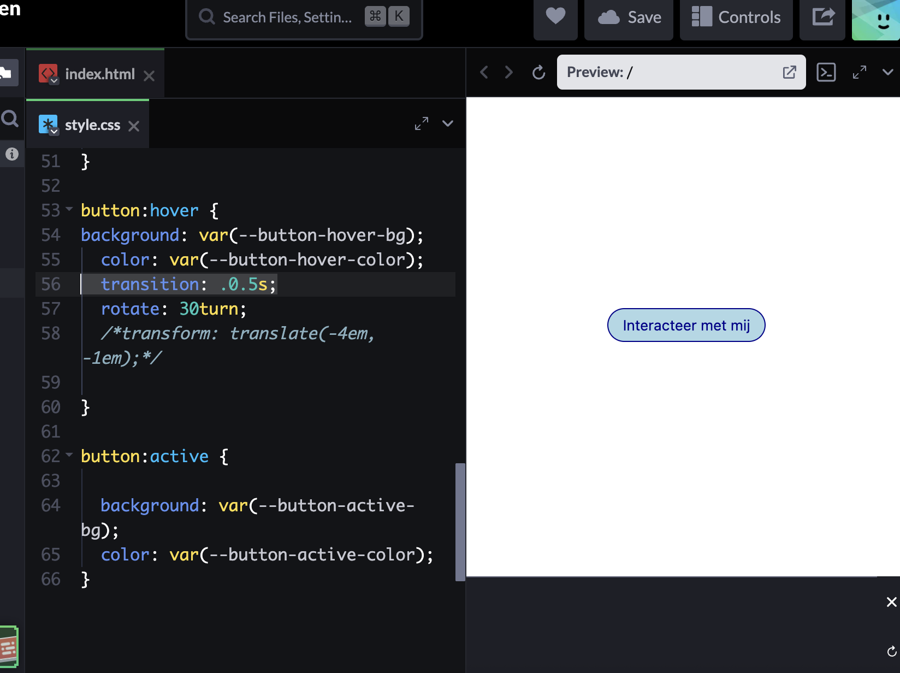
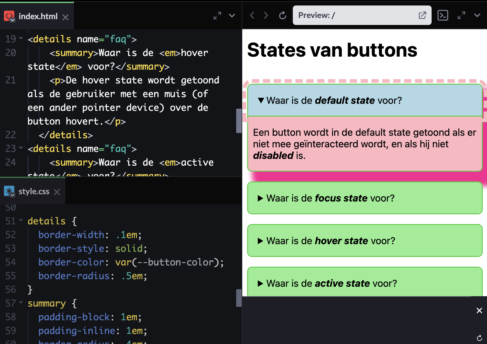

## 21 sep

Wat zijn HTML landmark role elements?
De speciale tekens die je een onderdeel geef waar je elke keer naar terug kan referen.

Wat zijn heading elementen en hoe horen deze 'genest' te worden?
Je moet eerste een header maken. Daarin kunnen tags zoals H1, H2,

Hoe ga jij met cookies om? Beschrijf jou beweeg redenen en of die zijn veranderd na het volgen van dit college.
Ik probeer altijd erg voorzichtig te zijn. Maar eigelijk vermijd je dit niet. Ik wil niet dat mensen of bedrijven zo snel mijn data hebben voor privicy redene. Alleen deze college heeft me wel iets meer geinformeerdt over hoe nutteloos het is om het oprecht aan te passne omdat ze het toch vaak stellen.

In deze college hadden wij een live code gedaan. En een college geluisterd. Van deze college heb ik weer een refresher in code gehad wat erg handig was.
Hiernaast hadden wij het gehad over cookjes en alles dat daarbij komt. Hiervan heb ik geleerdt hoe je er mee om gaat. Wat netjes en wat niet is. En hoe vormgeving hier aan toepas komt

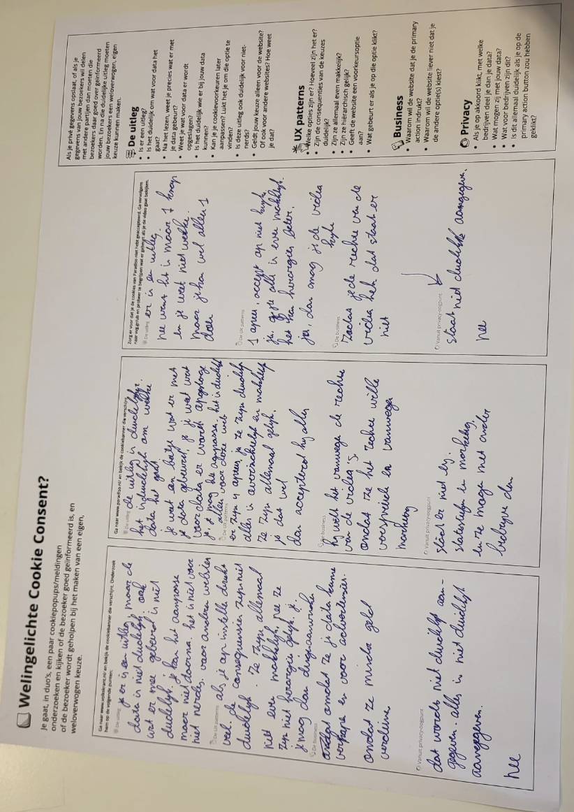

En hier zijn de screenshots van de natype code:
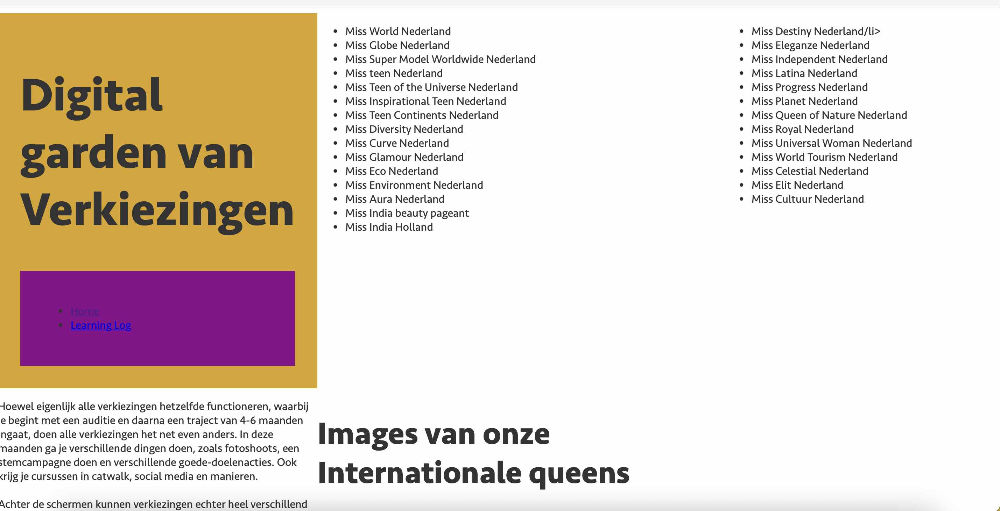
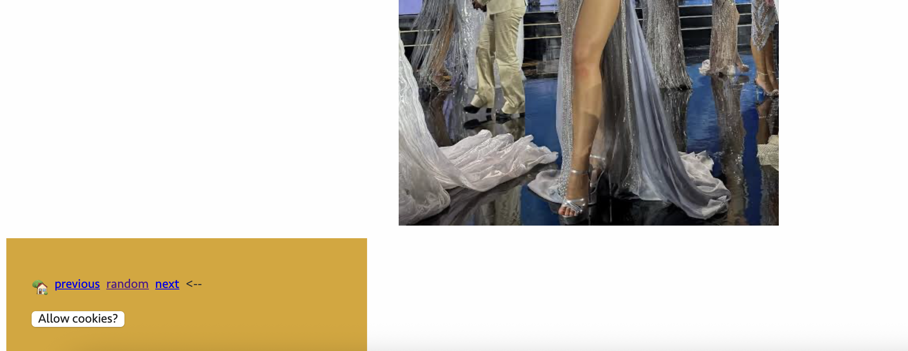
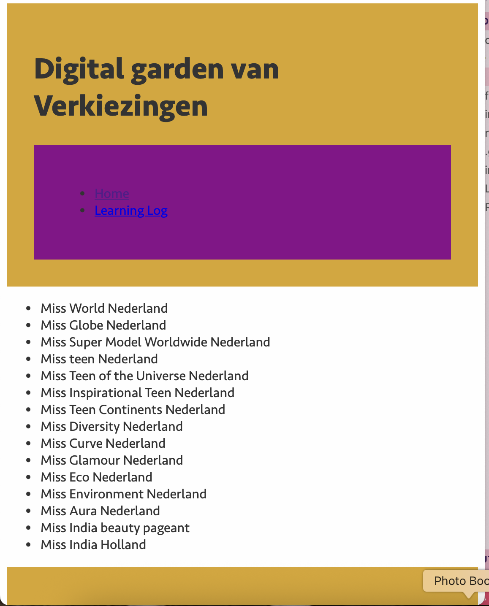
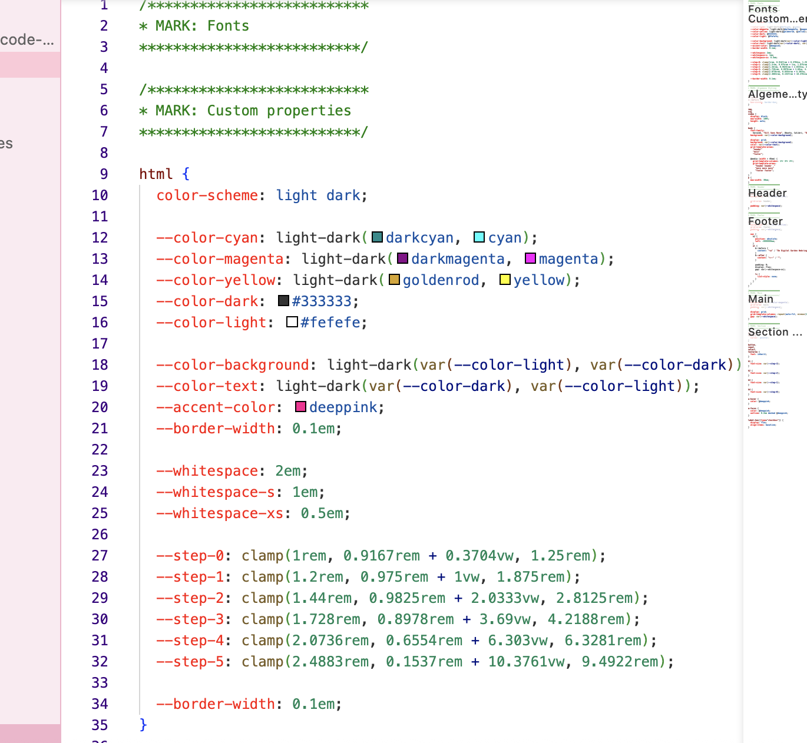

### 18 sep.

Waarom geven de docenten deze opdracht?
Voor verschillende redenen. Vooral om goede code te leren kennen. We hebben vaak ge 'vibe code' wat werkt maar vaak niet echte code is. Via deze opdracht leren we rauw code kennen. En er mee te werken.
Ook leren we beter het web kennen, Waardoor we meer weten wat er is, en welke kanten er zijn. Met een digital garden heb ik persoonlijk veel meer te weten gekomen over hoe divers het internet kan zijn. Ook hebben we dingen over hieragie geleerdt. Want zelfs een persoonlijke website moet inhoud bevatten.

Welke technieken gebruik ik?
Je gebruikt natuurlijk HTML en CSS. maar ook de gestalte dingen, en de profesionele competenties.
Ook natuurlijk de onderzoek manieren en de manieren van schetsen.

Wat zijn de randvoorwaarden?
Natuurlijk dat hij webby is, en daarvoor moet hij bijvoorbeeld toegankelijk zijn. En moet hij duidelijk je data aangeven.
adaptive zijn. en voor gelezen kunnen worden. Dat soort dingen zodat een website oprecht gebruikt kan worden voor iederen een niet gewoon voor jezelf of een kleine groep.
Hiernaas meot de vormgeving ook toegankelijk zijn, Zo moet je goede hieragie maken. Zodat mensen er makkelijk doorheen gaan.
Ook moet het mobiel en computer versies zijn. Moet je duidelijke en rauw code gebruikt hebben. En het zo goed als af hebben binnen 2 weken.

Waar gebruik je HTML/CSS voor?
Voor de rauwe code, Eigelijk kan je dit voor alles gebruiken.
Je gebruikt html voor de basis van de website voor alle letterlijke informatie.
En de css om alles mooi te maken

Wat kan er allemaal met CSS?
Je kan letterlijk alles met css behalven lettelrijke informatie.
Kleuren, vormen, achtergronden, en animaties.
de lay-outs en de grids.

Lukt het om verschillende ideeën te bedenken?
Deze module had ik er wat moeite mee. Ik heb moeite met code, waardoor ik zo veel mogelijk tijd moest stoppen in mijn code. Daardoor moet ik niet zo veel tijd had om echt werk te maken van alle schetsen en concepten.

Lukt het om je ideeën te schetsen?
Ja dat zeker, ik ben goed in wireframes en ik kan vaak realistisch kijken naar hoe hij oprecht eruit moet zien.
Vaak vindt ik hem wel wat moeilijk om hem echt door te zetten.

Wat doet deze CSS-property?
Daarmee kan je verschillende dingen specfieke neerzetten en animaties.

Welke content, en welke HTML heb ik nodig?
Voor een foto heb je een img tag nodig. voor text een P tag, voor koppen h2-h4.
Voor een lijst lu en li.

Hoe kan ik dit soort content vormgeven?
Door css verschillenden dingen te gebruiken. Zoals bijvoorbeeld background-color. size, en grid.

Wat als ik hier nu eens 1000 invul?
Dat wordt iets heel groot, en heel erg iets anders. Dan kan je goed zien of iets werkt of niet

Begrijpen bezoekers de site?
Ja, vanuit hovers en duidelijke plekken en knoppen is het moeilijk om niet de website te snappen.
Ik had het gemaakt zodat je niet hoeft te raden hoe de website werkt.

Wat vindt de opdrachtgever er van?
Hij vondt het een duidelijke website. Maar had liever nog wat meer letterlijks HTML gezien implaayts van de eerste pagina van illustratie.
Hiernaast vondt hij de huisstijl kloppen. En de pagina's duidelijk.

Werkt dit wel?
Veel werkte na veel sleutelen wel. Maar veel ook niet. Zo had ik meer adaptive gewilt. Meer pagina's en meer buttons en mischien zelfs animaties. Maar vanwegen gebrek van skills en tijd lukten dit niet.

Oooooh, kan dit óók?!
Ik had graag meer willen werken met grid, zodat het er allemaal meer uitzag als een 'prikboard' ook had ik meer met animaties, en speelden vidoes en interviews en fotos willen werken. Om een groter geheel te maken.

Reflecteren met the riddle:
Ik wilden weten hoe dingen zoals grid enzo werkgten. Hier ben ik ongeveer uit gekomen. Ik heb de deepdives bijgewoond, en veel leraren en websites om hulp gevraagt. Nu snap ik het iets wat beter

Wat wil(de) ik weten/bereiken?
En website maken die interactief en persoonlijke was. En die mijn concept duidelijk doorgaf.

Wat heb ik gedaan?
Een website gemaakt met verschillende items.

Wat was het resultaat?
Een interactive website met verschillende onderdelen. Die het concept van een soort interactief prikboard doorgeven.

Wat weet je nu (niet)?
Ik weet nu hoe ik verschillende displays gebruik. En hoe ik ervoor zorg dat een website interactief is.
Hoe ik een website light dark maakt. Ook ik codeer zonder dingen zoals divs te gebruiken.
Maar ik ken code nog niet goed genoeg. Er zijn veel dingen die ik nog niet goed begrijp. En als er iets fout gaat kan ik nog niet genoeg zien hoe ik het oplos.

Wat vond je (niet) leuk?
Coden is niet de taal voor mij. Zo vondt ik het onderzoeken en het illusteren en vormgeven erg look.
Maar alle letterlijke code taal heb ik gedaan met veel moeite. Dus ik ben blij dat het 90% gelukt is.

Voldoet het nog aan de eisen?
Ja, want hij is interactief. Met dingens zoals light en dark. er staat rauwe code in. Hij is zo webby als ik hem kon maken.

HTML validatie
Ja, tuurlijk is hij niet perfect. Maar zo goed als de code kon zijn is hij nu goed.
Er zitten geen grote fouten in.

Toegankelijkheids-check
Ja, alles heeft alt teksten, En hij is erg adaptive. Ook heeft hij light dark. Alleen had ik iets nog iets wat meer licht en donker kunnen zijn.

Is mijn website nog wel adaptief?
Hij werkt op alles scherm grotes, behalven de knoppen in de tweede pagina die ik nog wat had kunnen verstellen.
Maar voor de rest is alles adaptief.

Voldoet mijn website nog wel aan de wet?
Alle fonts en fotos zijn duidelijk met bronnen vermeld. En omdat deze website van eige gebruik is mag ik deze onderdelen gebruiken.
Alleen de data heb ik nog niet duidelijk geregistereed.

Zie ik mezelf nog wel terug in wat ik doe?
Daar had ik nu wat meer moeite mee. omdat ik door de tijd druk en de skill verschil niet de tijd had om echt sterk bij binnen still te staan

Hier naast had ik ook de retrospective opdracht gemaakt
En de title die ik dit heb gegeven was: de code rollercoaster

En de tekeningen

Ook had ik de feedback gekregen: hier was de feedback van het tussen gesprek:

### 17 sep.

Ik heb vandaag een stress curus gehad en daarna de propuduse uitreiking dus was ik op school aanwezig.

Hierna heb ik geprobeerd mijn grid aan te passen voor de web versie.
Hier kwam ik compleet niet uit haha.
Ik heb ICTers gevraagt. Maar hun kwamen er ook niet uit. Ik heb chat gevraagt. Hier heb ik geen schreenshots van omdat ik hier geen lijn code van heb gebruikt.
Omdat ik het zo niet begreep.
Maar gelukkig kwam Sanne aan de redding en heeft die mij geholpen over teams. Hier ven ik heel dankbaar voor.

### 16 sep

Wij hadden gekeken naar de ideale versie van onze website. Daarna hhebben anderen mensen ernaar gekeken en vanuit dit feedback nieuwe vormen gemaakt.
Mijn grote lijnen feedback was: dat ik mischien de vormgeving beter kan doorzetten. Door dus bijvoorbeld de title ook te teken

Ook, heb ik schetsen gemaakt voor mijn ideale web formaat pagina.

Hiernaast heb ik aan mijn website gewerkt. En heb ik sanne, Isaac, en Barbara.
Waarna dit wel werkten.

Een bron die ik heb gebruikt voor de grid area's
https://developer.mozilla.org/en-US/docs/Web/CSS/Reference/Properties/grid-template-areas

https://css-tricks.com/almanac/properties/g/grid/grid-template-areas/

Check out:
Noem 3 Gestaltprincipes op en laat de ander uitleggen wat ze betekenen en doen.
Scale, balance, contrast.
scale: waar je ogen gelijk op vallen. Dus het aandachts punt.

balance: dingen die gelijk zijn waardoor je ogen het als 1 geheel zien.

Contrast: als je grote en heftige kleuren bij normale kleuren zet om daar je aandacht naar te trekken.

Een grid biedt ruimte om te spelen (vrijheid), maar tegelijkertijd ook eenheid en structuur (vastigheid). Wat wordt hiermee bedoeld?
Omdat je via een grid het makkelijkst posties neer kan zetten waar ze horen. En je niet meer vast zit van een bestaande vorm.

Welk principe neem je mee in een laatste iteratie van je ontwerp?
Balance, scale, en visual hierarchy. Om de meeste ruimte te creeren. En het menselijkst te ontwerpen.

### sep 15

Voor de bronnen die ik vaker gebruik zijn;
https://www.w3schools.com/
https://stackoverflow.com/questions
https://dev.to/

Welke link ik had gebruikt voor de hidden sourch:
https://www.dofactory.com/html/img/hidden
https://www.monkeyvision.nl/kennisbank/alt-tekst/

Ik hhad ook mijn hover deze dag gebruikt. Maar hier kwam ik helaas niet uit. Ik heb deze bronnen gebruikt.
https://developer.mozilla.org/en-US/docs/Web/CSS/Reference/Selectors/:hover
https://www.w3schools.com/CSSref/sel_hover.php

Alleen hier kwam ik alsnog niet uit En moest ik het helaas aan chat vragen. Hier is het bewijs.
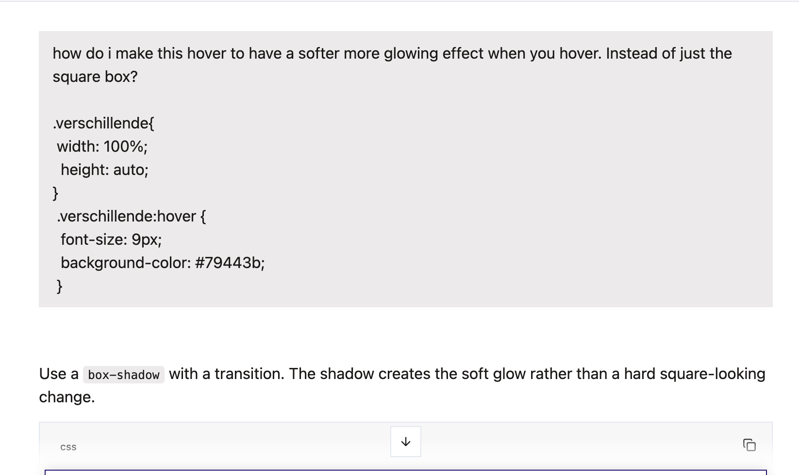
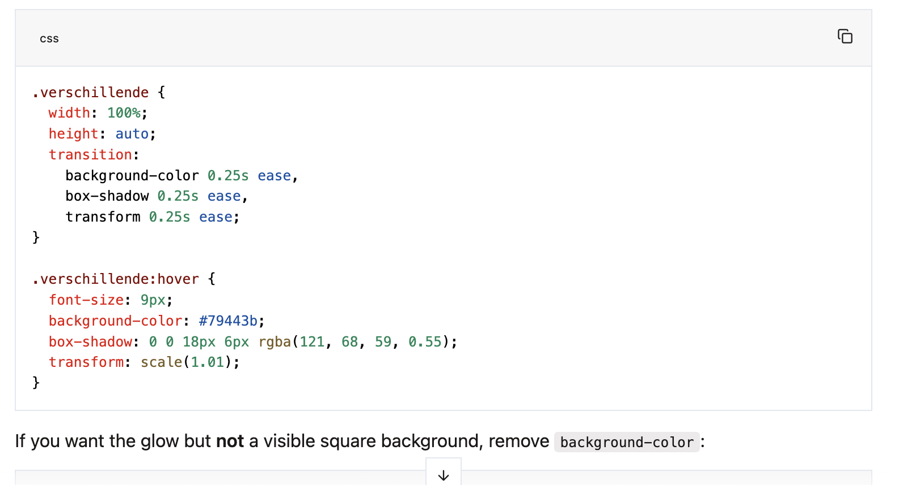
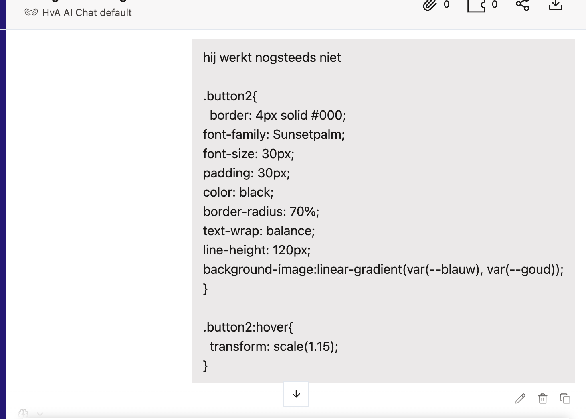
Maar hier heb ik eigelijk niks gebruikt.

Helaas kwam ik er niet ook niet bij. Maar toen ik perongelijk de halve van mijn tekst verwijdereden kwam ik tot: transform: scale(1.05). En toen ineens werkten dit

Hiernaast heb ik een deep dive in grid area gehad.

Hiernaast had ik niet helemaal door dat ik niet echt met DIV's mocht werken. En moest ik daarna veel veranderen.
En heeft een studenten leerling mij in de details nog een keer grid uitgelegt.
Dit was super lief en behulpzaam. En hoewel ik geen held ben. Ik het wel veel meer snap

###14 sep:
Leg uit wanneer een website 'lelijk' wordt en geef voorbeelden wat je kan doen om deze 'lelijke' onderdelen te fixen?
Als er geen vormgeving is, en als hij niet interactief meebeweegt

Vertel welke volgende stap je neemt om je website responsive te maken.
Door dingen zoals grids en padding toe te voegen.

Kun je het ontwerp en de bouw van je eigen Garden (zo uit je

hoofd) onderbouwen in Webby vocabulair?
Hij is interactief, en fluede en adaptief vanwege groter en kleiner worden van de fonts.
Ook vanwege light and dark mode is hij toegankelijk. En hij is expressief vanwege de tekeningen erin

We hebben klasikaal de artiekelen besproken. En een opdracht gedaan waarin we duidelijk konden zien waar, en hoe we het best onderzoek over dingen konden doen.
Hiervan heb ik geleerdt om anders naar bepaalde dingen te kijken. En te weten hoe en waar ik voor informaties onderzoek kan doen.

Hiernaast heb ik met een klasgenoot gekijekn naar mijn website, en hebben we samen deze vragen ingevult.

Hiernaast had een vriend die de ICT opleiding doet hulp nodig bij zijn HTML. Waarbij ik hem factueel en duidelijk grids kon uitleggen. Het werkte niet door een fout in zijn HTML. Maar ik stond er versteld van het feit dat ik de grid zo kon uitleggen. En dat ik het op deze manier begreep

Opdracht 16:
Wanneer is er een verandering van layout nodig: Waarneer hij groter of kleiner wordt. En er moet meer padding komen.

Opdracht 17:
Wij vonden het interessant dat het een soort game wordt.

En de websites waarin wij de interactie het leukst vonden was: 1.https://immersivebags.miumiu.com/en/ 2.https://why.zero.university/ 3.https://assets.awwwards.com/awards/external/2017/07/595badffaf6a2.mp4

###13 Sep.
Hier had ik kleine dingen gedaan, Ik had mijn header foto omgezet in een SVG. Hier had ik gelijk geleerdt hoe veel beter dit werkten. Ik zag gelijk wat de leraar bedoelden.
Ook kon ik hem makkelijker manipuleren in mijn pagina.

Hiernaast heb ik mijn best gedaan om light dark mode te maken met achtergrond foto's. Maar hier kwan ik niet uit. Helaas moest ik chatgpt om hulp vragen. Maar zelfs hiermee kwam ik er niet uit.

Hiernaast heb ik de videos en artiekelen gelezen voor de bi weekly. Hier heb ik geleerdt hoe het internet werkt. En waarom gecapitalizeerde data verkeerdt af kan lopen.

Dit waren mijn notities hiervan.

###11 september
In deze les heb ik feedback gekregen van mijn leraar. Dit was het geven feedback:
Joy feedback:
-Switchen naar SVG'S op je website (via illustrator of affinity SVG is vectoren, met CSS kan je dat stijlen. Je kan bijv. andere kleur geven met CSS. Kracht van je eigen tekenstijl en CSS. SVG blijft altijd scherp

-De tekst moet HTML zijn. Wat lastig is, is dat je niet weet hoe lang die tekst eruit komt te zien. De kader kan webby zijn. Met dit soort vormen zijn lastig, probeer iets anders

-Beoordeling op groei, ben je gegroeid? Welke competentie heb je moeite mee. Beoordeling ook op product: is die webby? De deepdives die we aanbieden of je dat ook in je website hebt verwerkt. Voldoende = Ik heb veel geleerd en dat laat je zien in je werk en je verslag. Voor je eigen werk hebt gemaakt en het stof beheerst komt het goed.

-Je mag een onafgemaakte pagina hebben binnen 2 weken, dat wordt ook niet van je verwacht. Ideale plaatje: Uitknipt in stukjes. Is een bepaalde fase van bruikbaarheid. In plaats van werken vanuit het doel werk je stap je voor stapje naar je doel. Opbouwen in plaats van alles tegelijk doen. Genoeg nemen met minder.

Hiervan heb ik geleerdt hoe ik het best in deze les werk. En hoe ik verder kan. Ook heb ik geleerdt wat zij van mijn verwachten.

Hiernaast heeft een studenten assisent bij geholpen mijn werk goed neer te zetten op github. En hoe hij mijn foto's duidelijk en goed en interactief plaats.
Hiervan heb ik geleerdt hoe ik @media werk.
Daarna heb ik de deep dive over grids bijgewoond. De screenshots hiervan zijn

Ik heb nu het gevoel alsof ik veel meer weet van grids, en van hoe ik een pagina opstel.
Dit waren dingen die ik hiervoor echt nog niet begreep.

###9 sep:
check out vragen:
Leg uit waar het Visual Research in 3 stappen naartoe werkt
Naar een visuale sfeer neerzetten die niet te letterlijk is. Zodat
je het best een vormgeving om je concept kan maken die je het
gevoel geeft die je wilt

Vertel in 2 zinnen waar jouw Garden over gaat, en met welke content je dat gaat doen (beeld, tekst, sound, animatie enz).
Miss verkiezingen. Ik wil persoonlijkheid en communite laten zien
in beeld. Dus zo min mogelijk profesionele fotos en zo veel
mogelijk 'rommelige' foto's.
Met tekst en kleur wil ik een whimsicale en vrouwlijke sfeer neerzetten. om girlhood neer te zetten.
Ik wil het neerzetten als een soort scrap book, of een soort poster board.

Vertel kort welk idee van de Crazy 8 je het liefst zou willen uitvoeren/ verder zou willen onderzoeken.
Ik wil concept 1 uitvoeren. Omdat concept 1 het beste de persoonlijkheid en de menselijkheid achter de verkiezingen neerzet.

Deze dag had ik ook de presentatie gedaan tegen iemand.
Waaruit deze conclussies kwamen:

Hiernaast hebben wij sfeerwoorden. moodboards, en typografie
moodboards gemaakt.
Dit waren de screenshots hiervan.
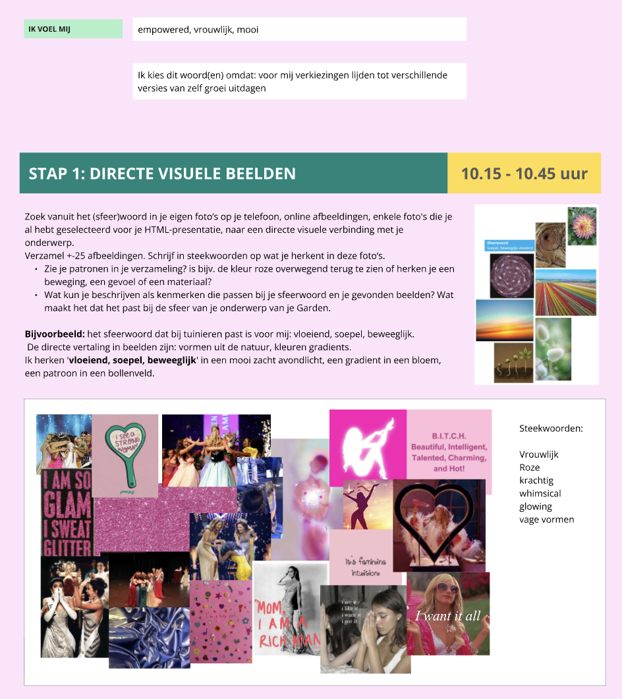

Hieruit heb ik een crazy 8 gemaakt:
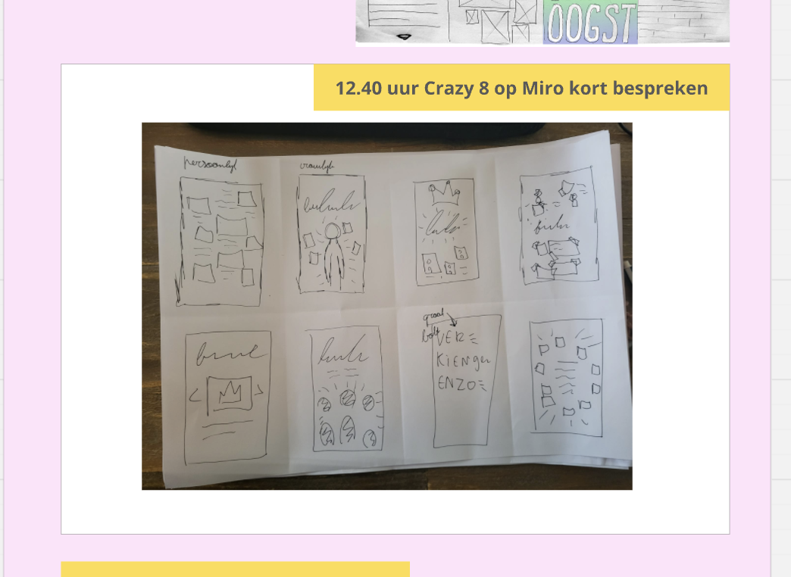
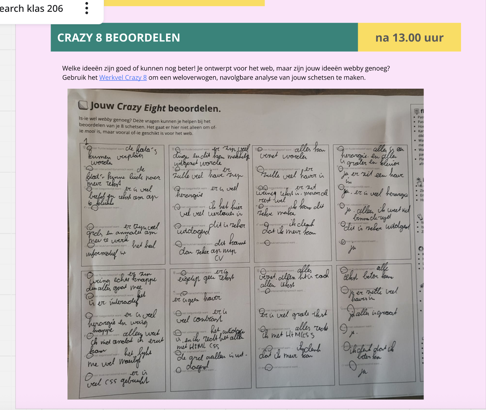

Hiervan heb ik snelle schetsen gedaan. En daarna heb ik deze uitgewerkt
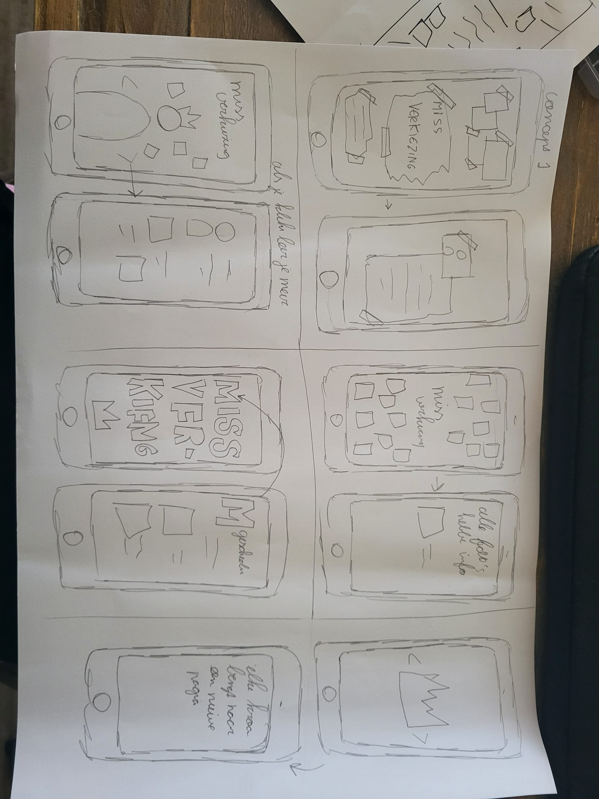
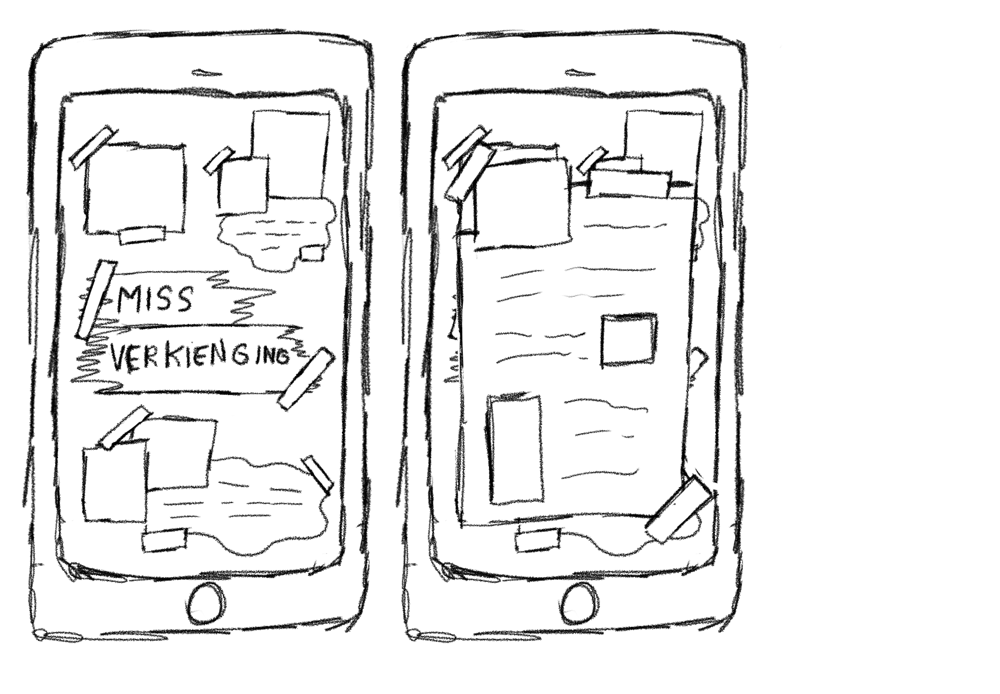
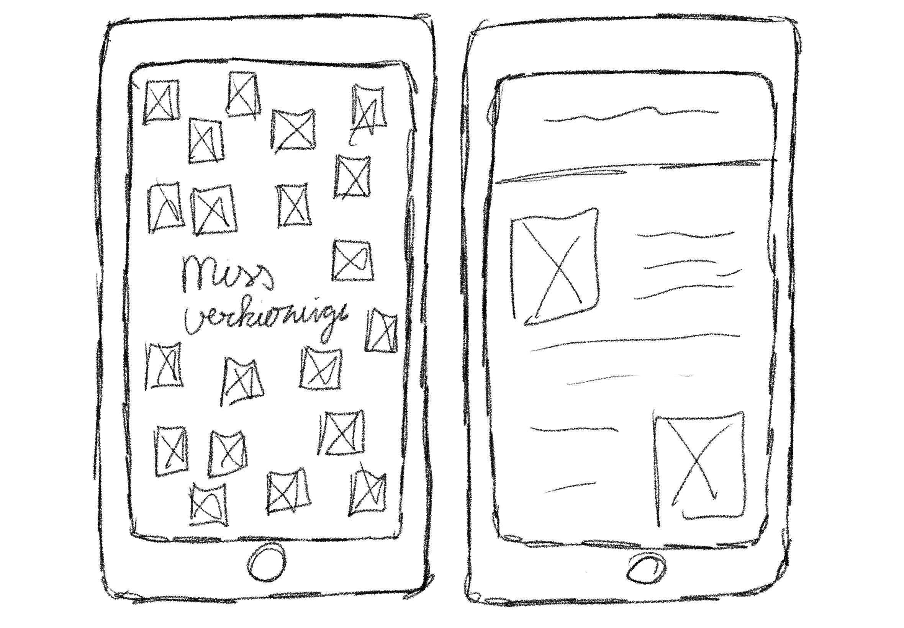
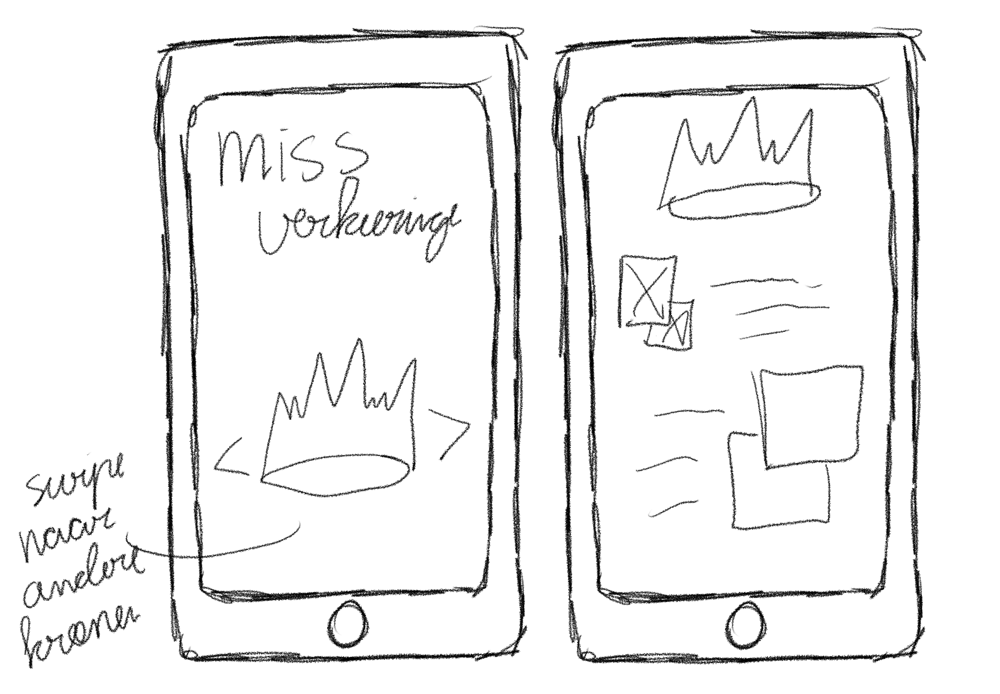
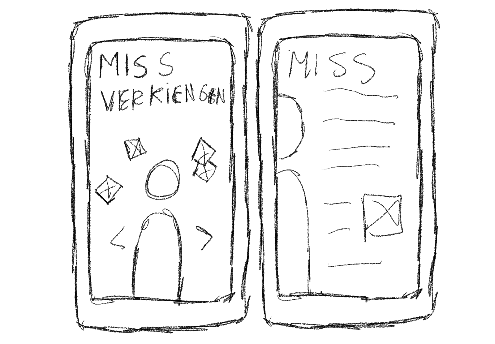
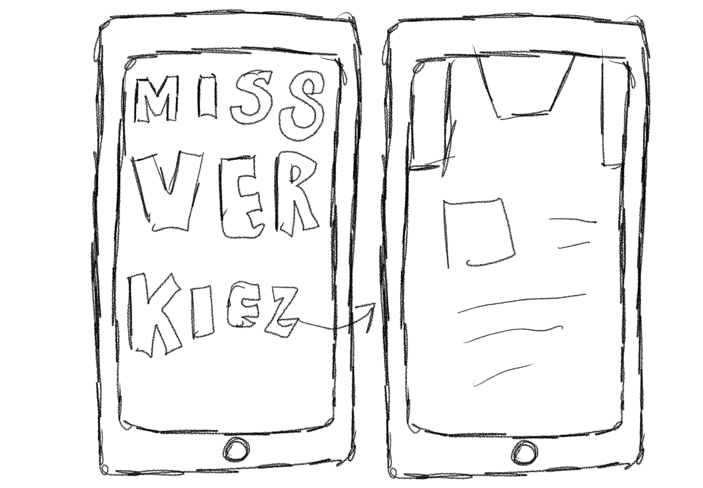
ik heb gekozen voor ontwerp 1

Mijn HTML uitgewerkt concept:
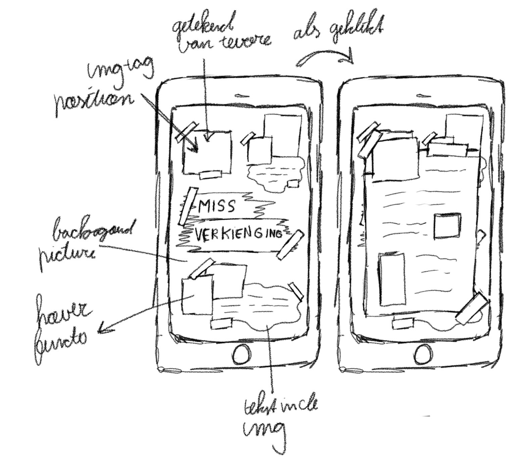

Hiernaast heb ik de gradient deep dive gemaakt.
De eerste spelletjes
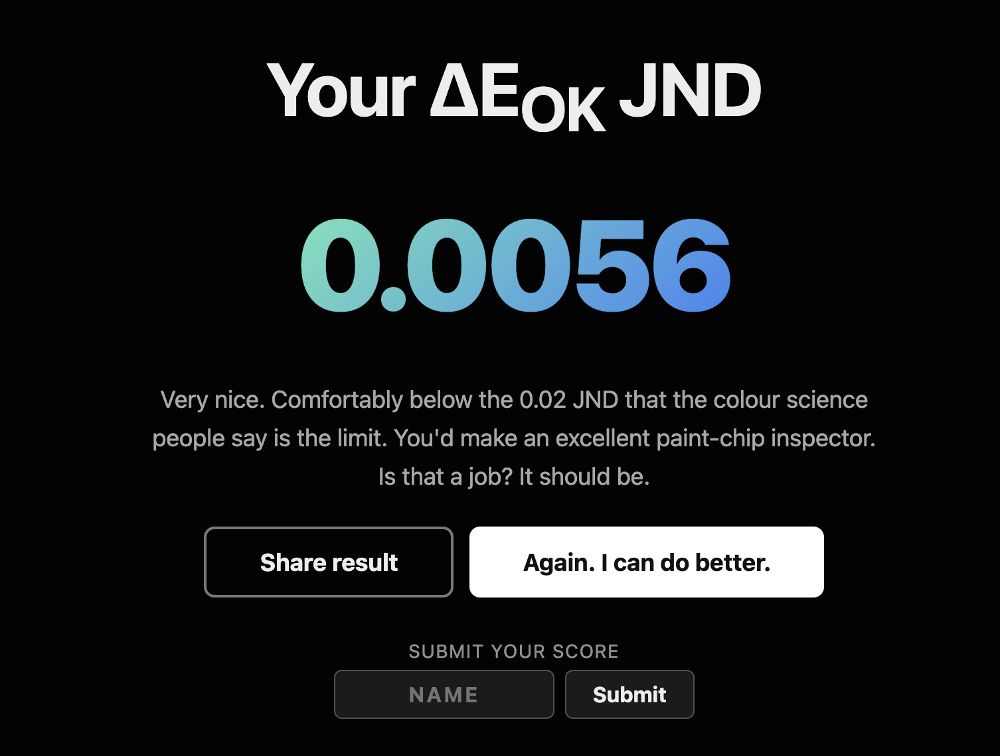
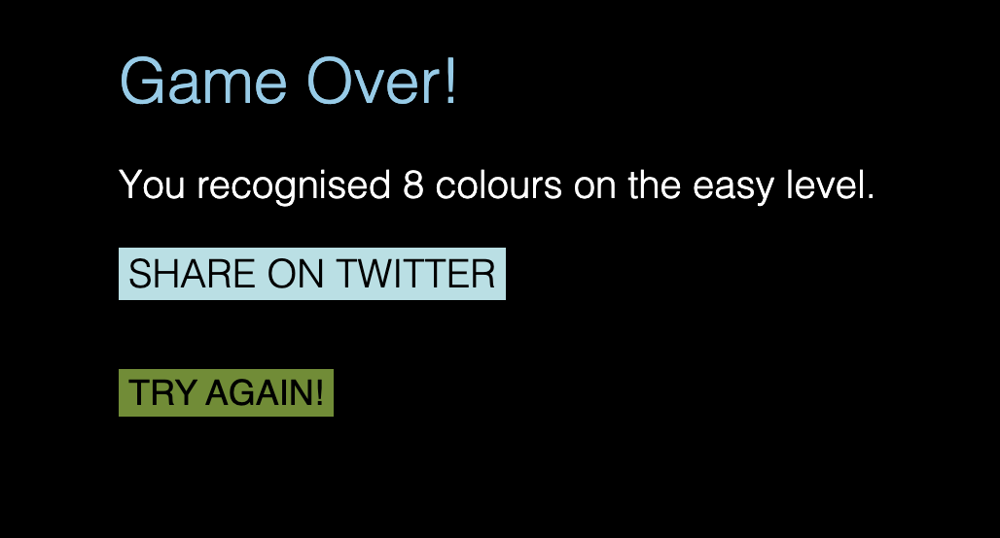


Opdracht 1
<video controls width="250">

  <source src="./images/opdracht_1GR.mov" type="video/webm" />
Opdracht 2
  <video controls width="250">
  <source src="./images/opdracht_2GR.mov" type="video/webm" />

###10 sept:
Helaas ben ik echt niet uit @property animeren gekomen.
Ik heb mijn best gedaan: zo heb ik deze links gebruikt.
https://developer.mozilla.org/en-US/docs/Web/CSS/Reference/At-rules/@property

https://www.w3schools.com/cssref/css3_pr_animation.php

https://developer.mozilla.org/en-US/docs/Web/CSS/Reference/At-rules/@property

https://css-tricks.com/exploring-property-and-its-animating-powers/

https://www.youtube.com/shorts/dba1xLnU9AM

https://www.youtube.com/watch?v=z2LQYsZhsFw

https://www.geeksforgeeks.org/css/css-keyframes-rule/

Helaas moest ik weer een chatgpt vraag stellen. Maar ook hier had ik weinig aan:


Wel heb ik tijd gestopt in het leren wat @propertys zijn
en hoe je deze gebruikt. Dit heb ik gedaan met de volgende onderdelen:
https://developer.mozilla.org/en-US/docs/Web/CSS/Guides/Cascading_variables/Using_custom_properties

http://web.simmons.edu/~grabiner/comm244/weekthree/css-basic-properties.html#text

https://css-tricks.com/almanac/rules/p/property/

Hiernaast heb ik een sterk begin gemaakt vanuit het maken van mijn html. Ik heb de eerste pagina gemaakt. en een van de sub pagina's
ik zou nog graag aan een leraar willen vragen hoe ik de kleineren fotos goed kan positioneren.
Hier is de vidoe hiervan

 <video controls width="250">
  <source src="./images/eerst_html_10_sep.mov" type="video/webm" />

###8sep:

Ik heb voor deze grid lay-out deze informatie gebruikt:
https://medium.com/@fatukunda/a-responsive-photo-grid-with-css-grid-layout-5d3bf6b71c0
https://www.w3schools.com/css/css_grid.asp
https://developer.mozilla.org/en-US/docs/Web/CSS/Reference/Properties/grid-template-columns
Ook heb ik chatgpt helaas gebruikt. Dit is het bewijs en de code veranderd is.
Omdat ik na heel heel veel sleutelen er niks lukte totdat ik chat om
hulp vraagte

de vragen die ik een chat heb gesteld:


En de code waar dit tot leed:


Dit waren de fotos van de stadiums van de grid:


En daarnaast heb ik opdracht 1 en 2 gemaakt van de light dark. Helaas
omdat ik volledig gaar ben en geen code meer kan zien, Zal ik morgen
beginnen aan opdracht 3


<video controls width="250">

  <source src="./images/opdracht_2.mov" type="video/webm" />

###7 sept
-Vanuit de inventarisatie: Wat zou je zelf willen maken?:
de website die ik als inspiratie zou willen nemen is:
https://nuel.pw/
Dit is de website die ik als inspiratie wil voordoen. Dingen zoals de pagina's over elkaar hebben gemaakt, om een collage te maken.

Ik wil het de 'sfeer' van een bewegende, levende poster te maken. Om mijn liefde van vormgeving ook voort te zetten.

-Welke webby dingen heb je gezien die je ook wil gebruiken?:
Ik wil het een echte colleage maken.

En minder een soort wikipedia. Ik neem dingen zoals dit: als voorbeeld.
https://virtual-viscera.neocities.org/
Ik wil het zo persoonlijk maken als ik kan, omdat mijn onderwerp ook gaat over miss verkiezingen personlijk maken.

-Welke eigen content zou je over het onderwerp kunnen schrijven? Wat is de toon, ​de context, het doel, wat zijn onderwerpen, wat is ‘het’ wat jou raakt!​

Ik wil het erg persoonlijk maken. Dus het niet alleen hebben over de manier hoe miss verkiezingen verlopen. En welke er zijn. Maar ook over hoe persoonlijk het is. En wat veel van deze meiden uit verkiezingen zoals dit halen.
Persoonlijk zit ik since 2024 in de verkiezings industrie. Dus weet ik niet alleen persoonlijk hoe het werkt. Maar ook hoe de mensen in de industrie zich vaak voelen.
Ik wil het hebben over de steroeptypes. En die doorbreken.

-Maak je gebruik van content van een ander? Hoe denk je dat te doen? En mag dat eigenlijk wel? Hoe kan je die content zo aanpassen dat het echt een eigen verhaal wordt? Dat het echt jouw content wordt, op jouw eigen garden?

Ik zou natuurlijk wel foto's nemen van verschillende verkiezingen. Naast een bron geven en een link naar de bijbehorende website waar de foto bijhoordt.
Zal ik hem ook proberen aan te passen, zodat hij mischine ge-illustreerdt is.
Ook zou ik proberen het zo veel mogelijk het niet letterlijk houden.

check out vragen:
-Leg uit wat een digital garden is en waarom dat anders is dan een reguliere website.
Een digital garden is een plek waar je je eigen ding kan doen, Denk eraan als een soort boeken kast.
Het is een blog, alleen dan voor je compleet eigen dingen. Zonder het publiek waar je normaal tegen praat
Het heeft ook geen upload datum, en het is je persoonlijke kleine 'dagboekje'

-Leg uit wat een website 'webby' maakt en welke websites jou het meeste inspireren.
De interactiviteit, de adaptiviteit, De toegankelijkheid. Het is volassen, experesief, en verassened. Het gebruikt veel onderdlene van het web dat het super interactive maakt.

-Vertel waar jij mee aan de slag wilt gaan bij het maken van jouw eigen digital garden let op: dit zijn jouw eerste ideeën, dit kan en mag veranderen in de loop van het programma.
ik wil het een soort poster maken. Omdat ik erg hou van vormgeving. Ook wil ik het erg persoonlijk maken, omdat mijn onderwerp ook heel erg gaat over het mensenlijk maken van de missverkiezingen.

Wij begonnen de dag met uitleg over de sprints en de manier hoe de rest van de deepdives zouden verlopen.
Hierna, in onze eigen klas hebben wij artiekelen gelezen en besproken over de verschillende gardens, En wat een garden een garden maakt, en waar deze vandaan komt.
Hiernaast hebben wij gekeken naar de anderen gardens van vorige jaren en met een nieuwe group besproken wat deze goed/ slecht/ niet duidelijk/ wel duidelijk maakte.
Of hij webby was en waarom. En hoe wij dit persoonlijk konden aanpassen.

###4 sep:
Ik had de deep dives: HTML en CSS basics. En praktisch css.
Hier heb ik veel geleerdt. Bij de HTML heb ik weinig notities gemaakt,
omdat ik het meeste al wel snapten.

Maar dit waren de antwoorden van mijn vragen.


Het staat model voor digitale tuintjes welke bij 'Het web is voor iedereen' door studenten worden gemaakt.

### 3 sept - [Workshop]

In deze workshop (de workshop Interactie: MMD, micro-interacties, forms) hadden we verschillende dingen weer terug gehaalt. Waarvan ook verschillenden design elementen zoals de affordance.

Hier heb ik een wok to walk oefening gemaakt. Zodat je weer kon oefenen met de elementen waar we net mee hadden gewerkt. Ik heb geprobeerdt cue's en de anderen elementen in de user interaction te zetten.

Hier heb ik een duidelijke en goede opfrisser gehad. En konden we weer design wise wakker geworden.

Later werdt ons aangeraden om meer onderzoek te doen. En meer om ons heen te kijken voordat we ontworpen. Ook om meer te schetsen. Dit had ik deze keer niet gedaan vanwegen het gebrek van tijd.
Maar in anderen momenten zou ik dit zeker doen.

Bij de tweede les had ik (font in css). Hierbij hadden we verschillende dingen geleerdt over fonts en font-face.
Dit zijn dingen die ik al had geleerdt. Maar het was erg fijn om met een nieuw persoon deze informatie te krijgen. Ook kregen wij info over welke fonts illegaal waren en niet. Zo mogen we google and adobe progromma's niet gebruiken. Behalven als we het downloaden van tevoren en in de map zetten.

Hierna hebben we verschillende opdrachten gedaan. Deze heb ik afgerond. Ik heb hulp gevraagt aan een klasgenoot en een leraar.

Dit zijn de screenshots van de opdrachten
opdracht 1

opdracht 2

opdracht 3

opdracht 4

 <source src="./images/opdracht_4.mov" type="video/mp4">

 <source src="./images/opdracht_4_2.mov" type="video/mp4">

Ook heb ik een voorbereiding gedaan op de volgende deep dive, deze deep dive is: Praktische CSS.
Hiervoor heb ik de css dinner game gemaakt.

3 Sep
Voor de deep dive: Html en css basic heb ik de aangegeven teksten en artiekelen gelezen.
Dit leed tot de volgende notities en vragen.
Ook had ik 2 artiekelen gelezen.

Hiernaast had ik ook de lelijke pagina van html opgesteld. Voor de diepdive: praktische css. Deze had ik gemaakt over miss verkiezingen.

## Learning Log

## 31 Augustus.

ik heb alles geinstaleerdt, en gekoppled wat gekoppled moest worden. Helaas kon ik niet VS codium gebruiken omdat mijn computer het niet aankon.
dus code ik in VS code,

vragen: Leg uit wat een source hosting platform is en voor welke jij gekozen hebt.
-Het is het platform waar je je website op zet zodat hj ergens gebacked staat.
Ik heb gekozen voor github-

Vertel welke domeinnaam jij gekozen hebt en hoe je die hebt gekoppeld aan jouw pagina.
-mijn domijn naam is Joyportfolio. Omdat ik mijn portfolio hier aan wil linken.

Ik heb dit gedaan door het via NSD te koppelen. Github van deze verifieren. En hiermee kan je met VS code schrijven.-

Beschrijf hoe je aanpassingen aan jouw pagina kunt maken en hoe je er voor zorgt dat die op het web gepubliceerd worden.
-Door het het op te slaan bij Github, En via hier wordt je website oprecht gerealizeerdt. En gekoppeled tot het bestaande domijn.-
